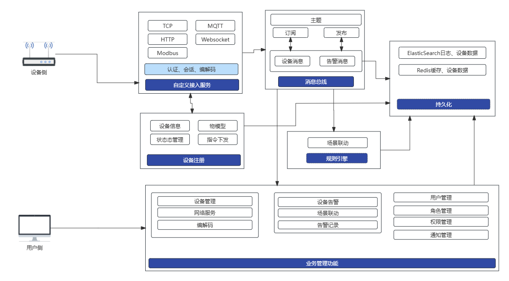

# go-iot

#### 介绍
使用go实现的iot接入系统，以`物模型`为主体用来对接不同厂商的设备来实现统一接入的目的

> 项目参考了https://github.com/jetlinks/jetlinks-community，https://github.com/megaease/easegress

前端工程：`gdouyang/go-iot-fe`

#### 架构图


#### 功能目录
- 产品管理
- 设备管理
- 规则引擎
- 通知管理
- 设备告警
- 角色管理
- 用户管理
- 系统设置

#### 网络协议
- tcp server
- tcp client
- mqtt broker
- mqtt client
- http server
- websocket server
- modbus tcp

#### 使用说明

1. ide 使用 VS Code
2. Go 版本与 `go.mod` 一致（当前 `go 1.24`）
3. `go mod tidy` 后构建：`go build -o bin/go-iot .`

运行依赖：

- **Redis**：设备运行态、HTTP Session、集群 eventpush 等
- **Elasticsearch**：业务元数据（当前 ORM）与时序数据
- **集群（可选）**：[集群配置、路由模型与注意事项](./doc/cluster.md)

```
docker run -d --name elasticsearchv7 -p 9200:9200 -p 9300:9300 -e "discovery.type=single-node" -e "ES_JAVA_OPTS=-Xms1024m -Xmx1024m" elasticsearch:7.17.7

docker run --name redis6 -d -it -p 6379:6379 redis:6
```

本地测试：

```
go test ./pkg/... -count=1 -short
```

#### 默认账号
> 首次启动若库中无用户：`admin` / 配置项 `admin.password`（默认 `123456`）  
> **生产务必**修改 `admin.password` 或环境变量 `GOIOT_ADMIN_PASSWORD`。  
> 密码使用 **bcrypt** 存储；历史 MD5 账号在登录成功后会自动升级。

#### 安全相关配置（P0）

| 配置 | 说明 |
|------|------|
| `admin.password` | 仅首次创建 admin 时生效 |
| `script.http-enabled` | 脚本 `HttpRequest` 总开关（默认 true） |
| `script.http-block-private` | 禁止脚本访问私网/本机（默认 true） |
| `script.vm-pool-size` | 每个产品编解码 JS 引擎池大小（默认 20，最大 500） |

管理 API 需登录；业务资源（设备/产品等）读写均校验角色权限。

#### 压力测试
- [压力测试](./doc/benchmark.md)